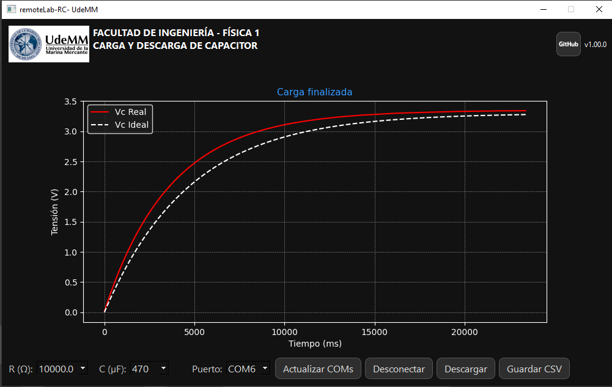

# 🧪 RemoteLab RC

**RemoteLab RC** es una interfaz gráfica en PyQt5 diseñada para visualizar en tiempo real la curva de carga y descarga de un capacitor en un experimento físico, controlado por un ESP32.

---

## 📁 Estructura del Repositorio

- `remotelab-rc/` → Proyecto principal con arquitectura MVC (Modelo-Vista-Controlador). Se conecta por puerto serie con un ESP32 real que mide y devuelve los valores de tensión.
- `simulator_serial_rc/` → Módulo auxiliar que simula el comportamiento del ESP32 y emite datos por puerto serie. Útil para desarrollo sin hardware.

---

## 🖥️ Tecnologías utilizadas

- Python 3.10+
- PyQt5
- Matplotlib
- Comunicación Serial (PySerial)
- ESP32 (firmware en C++)
- Arquitectura MVC

---

## 🌍 Resúmenes

### Español 🇪🇸
Este proyecto permite visualizar y guardar las curvas de carga/descarga de un capacitor, recibiendo datos desde un ESP32 o desde un simulador. Incluye controles para seleccionar R y C, e integra el logo de UdeMM.

### English 🇬🇧
This project provides a GUI to visualize and store RC charging/discharging curves. Data comes from a real ESP32 or a simulator. Includes R/C selection and UdeMM branding.

### Português 🇧🇷
Este projeto oferece uma interface gráfica para visualizar e salvar curvas de carga/descarga de um capacitor, com dados de um ESP32 real ou de um simulador. Permite escolher os valores de R e C, com marca da UdeMM.

---

## 🎥 Video demostrativo

Este video muestra el flujo completo de ejecución: conexión al COM, ejecución de carga y descarga, visualización de curvas y exportación a CSV.

Este video muestra el flujo completo de ejecución: conexión al COM, ejecución de carga y descarga, visualización de curvas y exportación a CSV.

Este video muestra el flujo completo de ejecución: conexión al COM, ejecución de carga y descarga, visualización de curvas y exportación a CSV.

