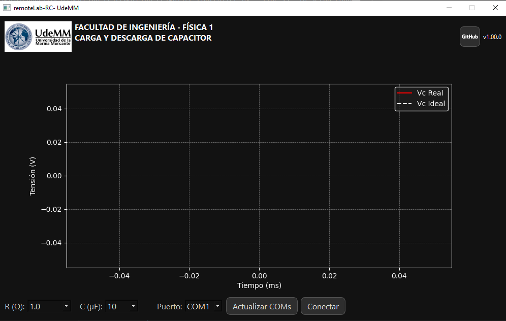
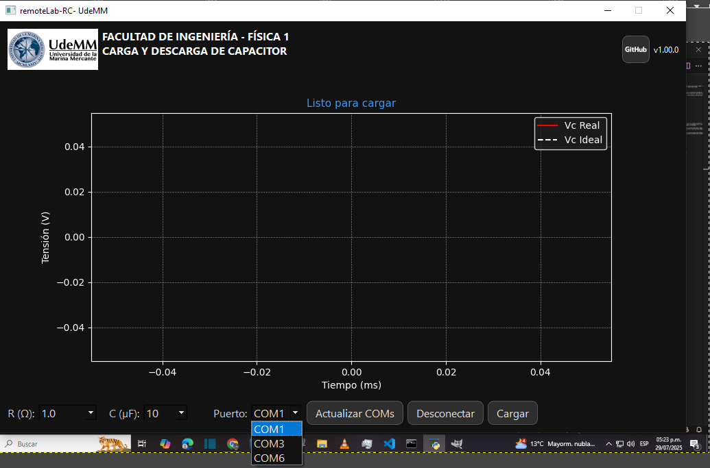
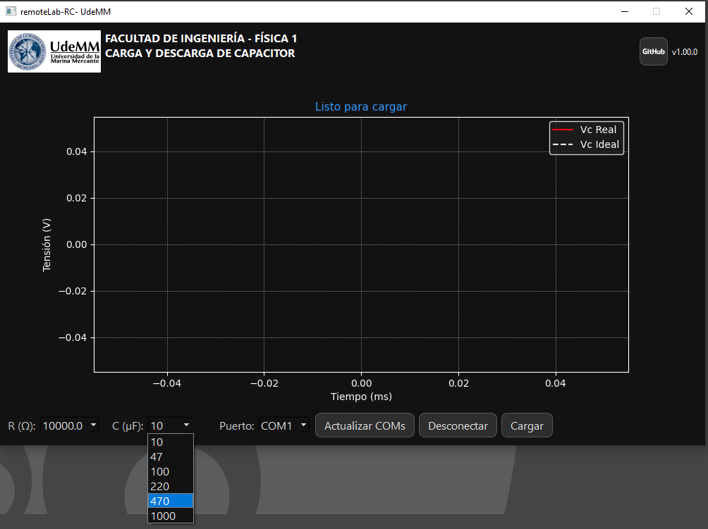

# ⚡ Visualizador RC - UdeMM

Visualizador interactivo de carga y descarga de capacitores usando una interfaz gráfica desarrollada en PyQt5. Permite visualizar en tiempo real la curva de tensión del capacitor y compararla con el modelo teórico ideal.

---

## 🎯 Objetivo del proyecto

El objetivo es permitir la visualización clara y educativa del comportamiento de un circuito RC. El sistema se conecta por puerto serie a un ESP32 que realiza el experimento real y transmite los datos de tensión en función del tiempo.

Este proyecto se enmarca dentro de una experiencia educativa desarrollada en la Universidad de la Marina Mercante (UdeMM).

---

## 🧠 Tecnologías y herramientas utilizadas

- **Python 3.10+**
- **PyQt5**: GUI moderna con tema oscuro.
- **matplotlib**: Gráficos en tiempo real.
- **Serial**: Comunicación con el ESP32.
- **ESP32-S3**: Dispositivo que mide la carga y descarga real.
- **GitHub**: Control de versiones y distribución.

---


## 📷 Capturas de pantalla

### 🟢 Vista al iniciar, sin conexión


### 🔵 Vista con puerto conectado, botones activos


### 🔴 Curva de carga en tiempo real


### 🛠️ Selección de resistencia y capacitancia



---

## 📝 Resumen

### 🇪🇸 Español
Visualizador RC es una herramienta educativa que permite observar el comportamiento de un capacitor durante su carga y descarga, comparando la curva real con la ideal. Se utiliza un ESP32 para ejecutar el experimento físico, y una app en Python para mostrar los datos recibidos en tiempo real, permitiendo además guardar los resultados.

### 🇺🇸 English
RC Visualizer is an educational tool that shows the behavior of a capacitor during charge and discharge, comparing real and ideal curves. It uses an ESP32 microcontroller to perform the physical experiment, and a Python app displays real-time data and allows result export.

### 🇧🇷 Português
O Visualizador RC é uma ferramenta educacional que mostra o comportamento de um capacitor durante carga e descarga, comparando curvas reais e ideais. Um ESP32 realiza o experimento físico e um aplicativo em Python exibe os dados em tempo real, com opção de exportação.

---

## 🚀 Cómo ejecutar

```bash
git clone https://github.com/tu_usuario/remotelab-rc.git
cd remotelab-rc
pip install -r requirements.txt
python main.py
```

---

## 📁 Estructura del proyecto

```
remotelab-rc/
│
├── core/                 # Lógica de negocio: modelo RC, CSV, conexión serie
├── gui/                  # Interfaz visual en PyQt5
├── assets/               # Íconos e imágenes
├── main.py               # Punto de entrada
├── app_config.py         # Configuración general
├── requirements.txt      # Dependencias
└── docs/                 # Imágenes para documentación
```


